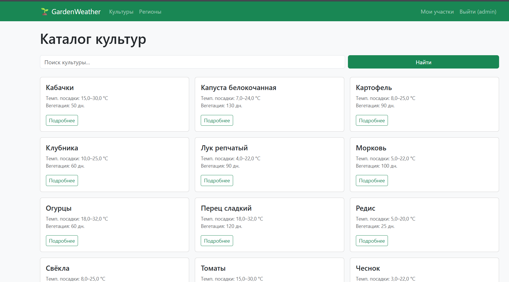
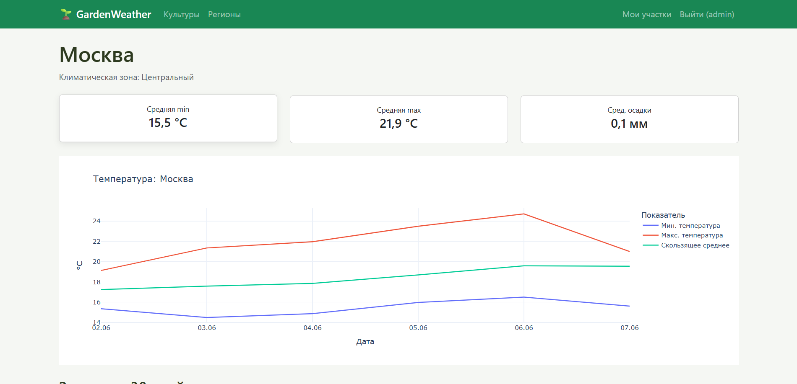
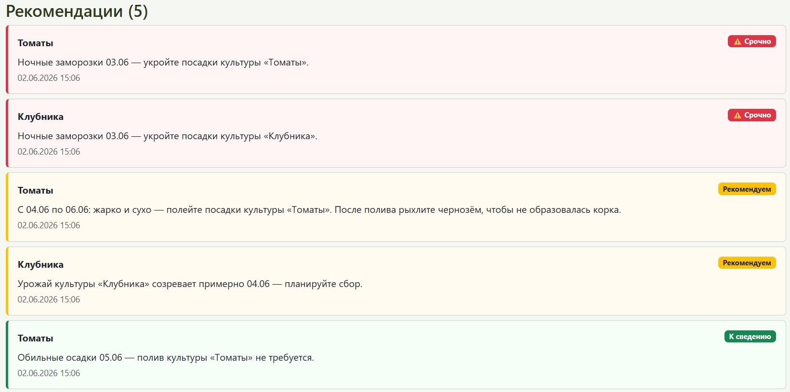

# 🌱 GardenWeather

Веб-сервис для дачников. Получает прогноз погоды через OpenWeatherMap API,
анализирует его с помощью Pandas и формирует персональные рекомендации по посадке
и уходу за культурами — с учётом погоды, типа почвы, сезона посадки и срока сбора урожая.

**🔗 Демо:** https://gardenweather.pythonanywhere.com

## Технологии
- **Python 3.12**, **Django 5.0**
- **SQLite** — база данных
- **Pandas**, **Plotly** — анализ и интерактивная визуализация погоды
- **requests** + **OpenWeatherMap API** — внешние погодные данные
- **Bootstrap 5.3** — адаптивный интерфейс

## Возможности
- Каталог из 12 культур с поиском по названию и описанию
- 6 регионов с интерактивными графиками температур (Plotly) и статистикой (Pandas)
- Регистрация с email, вход по логину или email
- Личный кабинет: участки с указанием региона и типа почвы
- Учёт статуса культуры (планируется / посажена) и даты посадки
- Умный движок рекомендаций: заморозки, полив с учётом почвы, сроки посадки по сезону,
  напоминание о сборе урожая — с ранжированием по срочности

## Скриншоты

### Каталог культур


### График и статистика погоды по региону


### Рекомендации в личном кабинете


## Локальный запуск

1. Клонируйте репозиторий:
   ```bash
   git clone https://github.com/Blorry/GardenWeather.git
   cd GardenWeather
   ```

2. Создайте и активируйте виртуальное окружение:
   ```bash
   python -m venv venv
   venv\Scripts\activate
   ```

3. Установите зависимости:
   ```bash
   pip install -r requirements.txt
   ```

4. Создайте файл `.env` в корне проекта по образцу `.env.example`:
   ```
   SECRET_KEY=любой-длинный-секретный-ключ
   DEBUG=True
   ALLOWED_HOSTS=127.0.0.1,localhost
   OWM_API_KEY=ваш_ключ_от_openweathermap
   ```
   Бесплатный ключ: https://openweathermap.org/api

5. Примените миграции и наполните базу данными:
   ```bash
   python manage.py migrate
   python manage.py seed_data
   python manage.py createsuperuser
   python manage.py fetch_weather
   python manage.py generate_recommendations
   ```

6. Запустите сервер:
   ```bash
   python manage.py runserver
   ```

7. Откройте http://127.0.0.1:8000/

## Архитектура
- `weather/models.py` — 6 моделей: Region, Culture, WeatherRecord, GardenPlot, Planting, Recommendation
- `weather/services/` — изолированная бизнес-логика:
  - `weather_api.py` — интеграция с OpenWeatherMap
  - `analytics.py` — агрегация данных через Pandas
  - `recommendation_engine.py` — формирование рекомендаций (погода + почва + сезон + урожай)
- `weather/management/commands/` — `seed_data`, `seed_weather`, `fetch_weather`, `generate_recommendations`
- `weather/auth_backends.py` — вход по логину или email