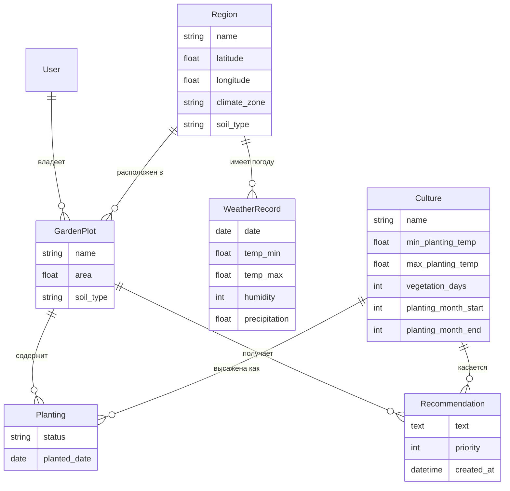

# Техническое задание: GardenWeather

## 1. Цель проекта
Веб-сервис мониторинга погодных условий для дачников. По геолокации участка
сервис получает прогноз погоды через внешнее API (OpenWeatherMap), анализирует
его и формирует персональные рекомендации по посадке и уходу за культурами
с учётом погоды, типа почвы, сезона посадки и срока созревания урожая.

## 2. Роли пользователей
- **Гость** — каталог культур с поиском, графики и статистика погоды по регионам.
- **Зарегистрированный пользователь** — создание участков, добавление культур
  со статусом и датой посадки, получение персональных рекомендаций.
- **Администратор** — управление справочниками (культуры, регионы, погода) через админ-панель.

## 3. Схема данных (сущности)
1. **Region** — регион/область: `name`, `latitude`, `longitude`, `climate_zone`, `soil_type` (типичная почва региона).
2. **Culture** — культура: `name`, `description`, `min_planting_temp`, `max_planting_temp`,
   `vegetation_days`, `planting_month_start`, `planting_month_end`, `image`.
3. **WeatherRecord** — запись погоды: `region` (FK), `date`, `temp_min`, `temp_max`, `humidity`, `precipitation`.
4. **GardenPlot** — участок: `user` (FK), `region` (FK), `cultures` (M2M через Planting),
   `name`, `area`, `soil_type` (почва конкретного участка).
5. **Planting** — связка участок-культура: `plot` (FK), `culture` (FK), `status` (планируется/посажено), `planted_date`.
6. **Recommendation** — рекомендация: `plot` (FK), `culture` (FK), `text`, `priority`, `created_at`.

### ER-диаграмма

## 4. Ключевой функционал (User Stories)
- **Каталог и поиск:** гость просматривает культуры, ищет по названию или описанию,
  видит температуру и сроки посадки каждой культуры.
- **Аналитика погоды:** на странице региона строится интерактивный график температур
  и осадков (Plotly) и сводная статистика (Pandas: средние min/max, осадки).
- **Личный кабинет:** пользователь создаёт участок (регион + тип почвы), добавляет культуры,
  указывает статус («планируется»/«посажено») и дату посадки.
- **Умные рекомендации:** система сравнивает прогноз с требованиями культур и формирует советы:
  укрытие от заморозков, полив (с учётом типа почвы), благоприятные сроки посадки (с учётом
  сезона), напоминание о сборе урожая. Советы ранжируются по срочности.
- **Обновление данных:** менеджмент-команды получают погоду из API и пересчитывают рекомендации.

## 5. Технический стек и интеграции
- **Backend:** Python 3.12, Django 5.0
- **БД:** SQLite
- **Внешнее API:** OpenWeatherMap (через `requests`)
- **Аналитика:** Pandas (агрегация, скользящее среднее), Plotly (интерактивные графики)
- **Frontend:** Bootstrap 5.3, наследование шаблонов, адаптивная вёрстка
- **Аутентификация:** регистрация с email, вход по логину или email